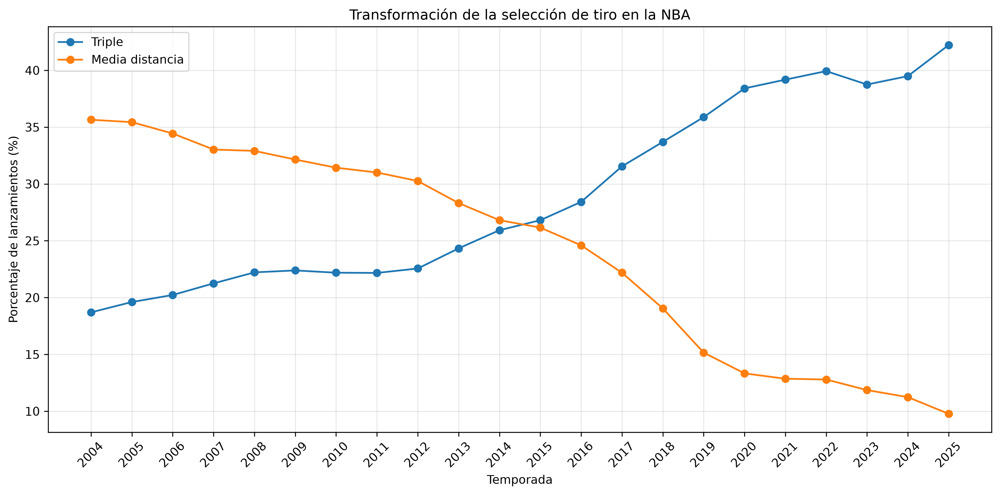
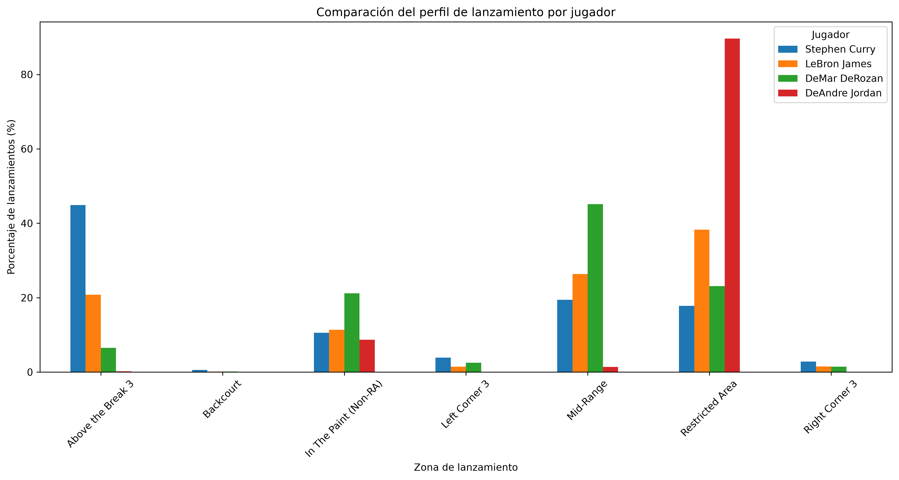
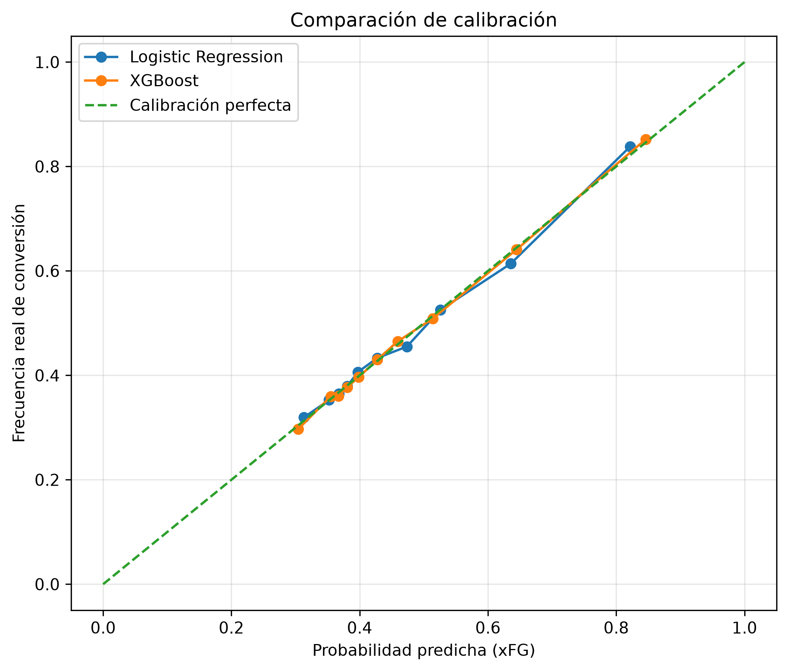
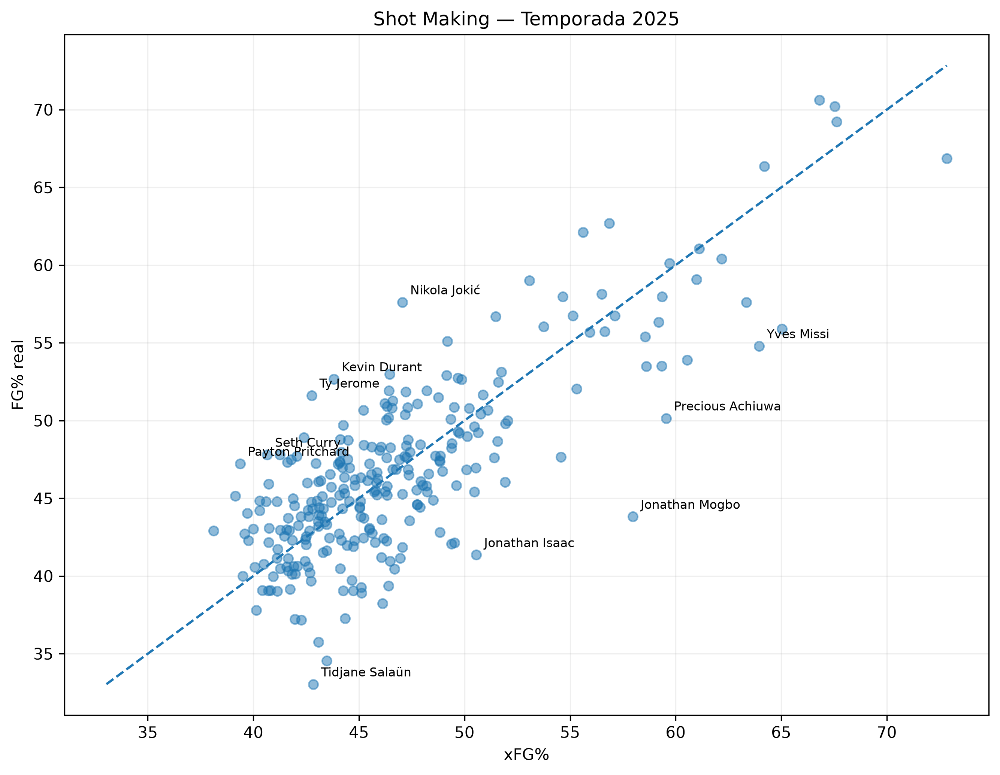
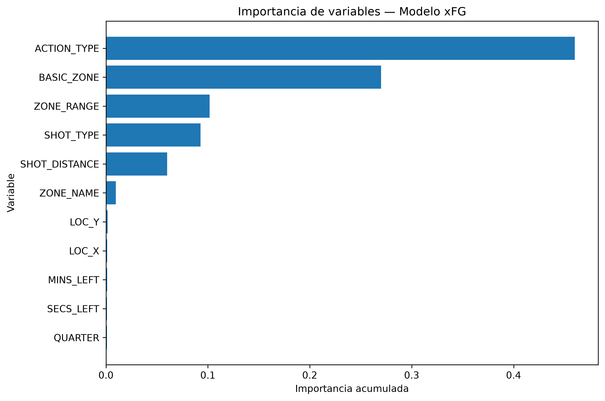

# 🏀 NBA Shot Intelligence

### Análisis de más de 20 temporadas de lanzamientos NBA y desarrollo de un modelo de Expected Field Goal Percentage (xFG%)

NBA Shot Intelligence es un proyecto end-to-end de Data Science orientado al análisis de la selección y eficiencia de los lanzamientos en la NBA.

El proyecto analiza más de **4,4 millones de lanzamientos** correspondientes a temporadas comprendidas entre **2003-04 y 2024-25**, estudiando la evolución histórica de la selección de tiro, los perfiles ofensivos de distintos jugadores y los factores asociados a la probabilidad de conversión.

A partir de estos datos se desarrolla un modelo de Machine Learning capaz de estimar la probabilidad de conversión de cada lanzamiento (`xFG%`) y se construye una métrica de **Shot Making** para comparar el rendimiento real de los jugadores con el esperado según las características de sus tiros.

---

## 🎯 Objetivos

Los principales objetivos del proyecto son:

- Analizar cómo evolucionó la selección de tiro en la NBA durante más de dos décadas.
- Identificar diferencias entre perfiles ofensivos y zonas de lanzamiento.
- Estudiar la relación entre distancia, ubicación, tipo de lanzamiento y eficiencia.
- Desarrollar un modelo de Machine Learning para estimar `xFG%`.
- Evaluar la capacidad del modelo para generalizar sobre una temporada futura.
- Construir una métrica de `Shot Making` basada en la diferencia entre FG% real y xFG%.

---

## 📊 Dataset

El dataset contiene información a nivel de lanzamiento de temporadas NBA comprendidas entre **2003-04 y 2024-25**.

Después del proceso de limpieza se analizaron aproximadamente **4,44 millones de lanzamientos**.

Entre las principales variables se encuentran:

- Jugador y equipo.
- Temporada y partido.
- Resultado del lanzamiento.
- Tipo de lanzamiento.
- Zona de la cancha.
- Distancia al aro.
- Coordenadas `LOC_X` y `LOC_Y`.
- Cuarto y tiempo restante.

Debido al tamaño del archivo original, el dataset no se almacena directamente en el repositorio.

---

## 🔬 Metodología

El proyecto se desarrolló en distintas etapas:

1. **Exploración y limpieza de datos**
   - Análisis de estructura y calidad.
   - Identificación y eliminación de duplicados.
   - Análisis de la variable objetivo.

2. **Análisis exploratorio**
   - Distribución de lanzamientos por zona.
   - Eficiencia y puntos por intento.
   - Evolución histórica de la selección de tiro.
   - Comparación de perfiles ofensivos.
   - Shot charts y mapas de densidad.

3. **Modelado**
   - Regresión Logística como baseline.
   - XGBoost como modelo no lineal.
   - Evaluación mediante métricas de clasificación y probabilísticas.
   - Análisis de calibración.
   - Validación temporal utilizando la temporada 2025 como holdout.
   - Optimización controlada de hiperparámetros.

4. **Aplicación del modelo**
   - Estimación de `xFG%` por lanzamiento.
   - Agregación de xFG por jugador.
   - Desarrollo de la métrica `Shot Making`.
   - Análisis de importancia de variables.

---

## 📈 Evolución de la selección de tiro

El análisis histórico muestra una transformación significativa en la selección de lanzamientos de la NBA.

Entre 2004 y 2025:

| Métrica | 2004 | 2025 |
|---|---:|---:|
| Lanzamientos de 3 puntos | 18,70 % | 42,23 % |
| Mid-Range | 35,65 % | 9,77 % |
| Distancia promedio | 11,60 ft | 14,02 ft |
| FG% | 43,87 % | 46,67 % |
| Puntos por intento | 0,94 | 1,09 |

La participación de los triples aumentó **23,53 puntos porcentuales**, mientras que los tiros de media distancia disminuyeron **25,88 puntos porcentuales**.

Los resultados muestran que gran parte de la transformación de la selección de tiro se produjo mediante la sustitución de lanzamientos de media distancia por tiros de tres puntos, mientras que los intentos cercanos al aro mantuvieron una presencia relevante.

<p align="center">
  
</p>

---

## 👤 Perfiles de lanzamiento

Los patrones de lanzamiento muestran diferencias importantes entre distintos perfiles ofensivos.

Como ejemplo, se analizaron cuatro jugadores con estilos claramente diferenciados:

- **Stephen Curry:** elevada concentración de lanzamientos exteriores, especialmente Above the Break 3.
- **LeBron James:** fuerte presencia en Restricted Area combinada con lanzamientos desde distintas zonas.
- **DeMar DeRozan:** elevada utilización de la media distancia.
- **DeAndre Jordan:** concentración extremadamente alta de intentos alrededor del aro.

Estas diferencias muestran por qué el FG% por sí solo no representa completamente la dificultad de los lanzamientos que toma cada jugador.

<p align="center">
  
</p>

---

## 🤖 Modelo de Expected Field Goal (xFG%)

El objetivo del modelado consiste en estimar la probabilidad de conversión de cada lanzamiento a partir de sus características.

Las variables utilizadas incluyen:

- Distancia del lanzamiento.
- Coordenadas en la cancha.
- Tipo de lanzamiento.
- Tipo de acción.
- Zona y rango de lanzamiento.
- Cuarto y tiempo restante.

Se utilizó una **Regresión Logística** como modelo baseline y posteriormente se entrenó un modelo **XGBoost** para capturar relaciones no lineales entre las características de los lanzamientos.

### Comparación de modelos

| Métrica | Logistic Regression | XGBoost |
|---|---:|---:|
| Accuracy | 0,6266 | **0,6324** |
| ROC-AUC | 0,6543 | **0,6635** |
| Log Loss | 0,6409 | **0,6344** |
| Brier Score | 0,2259 | **0,2231** |

XGBoost presentó mejores resultados en las principales métricas probabilísticas, por lo que fue seleccionado como modelo principal.

---

## ⏳ Validación temporal

Para obtener una evaluación más realista de la capacidad de generalización, el modelo final fue entrenado utilizando lanzamientos de las temporadas **2021-2024** y evaluado exclusivamente sobre la temporada **2025**.

| Métrica | Random Split | Temporal Split |
|---|---:|---:|
| Accuracy | 0,6324 | 0,6321 |
| ROC-AUC | 0,6635 | 0,6602 |
| Log Loss | 0,6344 | 0,6360 |
| Brier Score | 0,2231 | 0,2237 |

La pequeña variación entre ambas evaluaciones indica que el modelo mantiene un rendimiento estable al aplicarse sobre una temporada futura no utilizada durante el entrenamiento.

---

## 🎯 Calibración del modelo

Dado que el objetivo es producir probabilidades interpretables como `xFG%`, se evaluó la calibración del modelo.

Un modelo correctamente calibrado debería producir probabilidades consistentes con la frecuencia real de conversión. Por ejemplo, entre lanzamientos con un xFG cercano al 70 %, aproximadamente el 70 % deberían ser convertidos.

XGBoost mostró una correspondencia muy cercana entre las probabilidades estimadas y las frecuencias reales observadas.

<p align="center">
  
</p>

---

## 🏀 Shot Making

A partir de las probabilidades generadas por el modelo se construyó una métrica para evaluar el rendimiento de los jugadores respecto a la dificultad esperada de sus lanzamientos.

La métrica se define como:

**Shot Making = FG% real − xFG%**

Un valor positivo indica que el jugador convierte sus lanzamientos por encima de lo esperado según el modelo, mientras que un valor negativo indica un rendimiento inferior al esperado.

Para reducir el efecto de muestras pequeñas, el análisis de la temporada 2025 considera jugadores con al menos **300 lanzamientos**.

<p align="center">
  
</p>

Entre los jugadores analizados, **Nikola Jokić** presentó la mayor diferencia positiva, con un FG% de **57,62 %** frente a un xFG% de **47,06 %**, equivalente a un Shot Making de **+10,57 puntos porcentuales**.

También se observaron diferencias positivas destacadas en jugadores como Kevin Durant, Ty Jerome, Payton Pritchard y Seth Curry.

---

## 🔍 Importancia de variables

El análisis de importancia de variables muestra que las predicciones de XGBoost se encuentran principalmente determinadas por las características propias del lanzamiento y su ubicación.

Las variables con mayor importancia fueron:

1. `ACTION_TYPE`
2. `BASIC_ZONE`
3. `ZONE_RANGE`
4. `SHOT_TYPE`
5. `SHOT_DISTANCE`

Estas características concentran aproximadamente el **98 % de la importancia acumulada** del modelo.

<p align="center">
  
</p>

Las coordenadas individuales (`LOC_X`, `LOC_Y`) presentan menor importancia adicional debido, en parte, a que otras variables como la zona, el rango y la distancia ya contienen información espacial del lanzamiento.

Las variables relacionadas con el tiempo restante y el cuarto presentan una influencia considerablemente menor.

---

## 📁 Estructura del repositorio

```text
nba-shot-intelligence/
│
├── data/
│   ├── raw/                  # Dataset original
│   └── processed/            # Datos procesados
│
├── models/                   # Modelos entrenados
│
├── notebooks/
│   ├── 01_eda.ipynb          # Análisis exploratorio
│   └── 02_modeling.ipynb     # Modelado, evaluación y xFG
│
├── reports/
│   ├── figures/              # Visualizaciones principales
│   └── powerbi/              # Archivos de Power BI
│
├── src/
│   ├── preprocessing.py      # Configuración y validación de features
│   └── predict.py            # Inferencia del modelo xFG
│
├── .gitignore
├── README.md
└── requirements.txt

---

## 🛠️ Tecnologías utilizadas

- **Python**
- **Pandas** y **NumPy** — manipulación y análisis de datos.
- **Matplotlib** y **Seaborn** — visualización.
- **Scikit-learn** — pipelines, preprocesamiento, Regresión Logística y evaluación.
- **XGBoost** — modelo final de Machine Learning.
- **Joblib** — serialización del modelo.
- **Jupyter Notebook** — análisis exploratorio y experimentación.
- **Git & GitHub** — control de versiones y publicación del proyecto.

---

## 🚀 Ejecución del proyecto

### 1. Clonar el repositorio

```bash
git clone https://github.com/lucasbottino9/nba-shot-intelligence.git
cd nba-shot-intelligence
```

### 2. Crear el entorno virtual

```bash
python -m venv venv
```

Activar el entorno en Windows:

```bash
venv\Scripts\activate
```

### 3. Instalar las dependencias

```bash
pip install -r requirements.txt
```

### 4. Agregar el dataset

Debido a su tamaño, el dataset original no se encuentra almacenado directamente en el repositorio.

El archivo debe ubicarse en:

```text
data/raw/NBA_2004_2025_Shots.csv
```

### 5. Ejecutar los notebooks

El análisis está dividido en:

```text
notebooks/01_eda.ipynb
notebooks/02_modeling.ipynb
```

`01_eda.ipynb` contiene el análisis exploratorio de los datos.

`02_modeling.ipynb` contiene el desarrollo, evaluación y aplicación del modelo de xFG.

---

## 🔮 Predicción de xFG

El modelo entrenado puede reutilizarse mediante `src/predict.py` para estimar la probabilidad de conversión de nuevos lanzamientos.

Ejemplo:

```python
import pandas as pd

from src.predict import predict_xfg

shot = pd.DataFrame([{
    "SHOT_DISTANCE": 25,
    "LOC_X": 5.0,
    "LOC_Y": 24.0,
    "QUARTER": 4,
    "MINS_LEFT": 2,
    "SECS_LEFT": 30,
    "SHOT_TYPE": "3PT Field Goal",
    "ACTION_TYPE": "Jump Shot",
    "BASIC_ZONE": "Above the Break 3",
    "ZONE_NAME": "Center(C)",
    "ZONE_RANGE": "24+ ft."
}])

result = predict_xfg(shot)

print(f"xFG estimado: {result['xFG'].iloc[0]:.2%}")
```

El resultado representa la probabilidad estimada de conversión del lanzamiento según sus características.

---

## ⚠️ Limitaciones

El modelo utiliza exclusivamente las características disponibles en el dataset.

No se dispone de información sobre algunos factores que pueden afectar significativamente la dificultad de un lanzamiento, como:

- Distancia del defensor.
- Nivel de contestación del tiro.
- Movimiento de los jugadores.
- Posición de los defensores.
- Contexto táctico de la posesión.

Además, variables como `ACTION_TYPE`, `BASIC_ZONE`, `ZONE_RANGE` y `SHOT_DISTANCE` contienen información parcialmente redundante sobre las características del lanzamiento.

Por este motivo, el `xFG%` debe interpretarse como una estimación basada en las variables disponibles y no como una representación completa de todos los factores que determinan la dificultad de un tiro.

Del mismo modo, la métrica `Shot Making` representa el rendimiento respecto al valor esperado por el modelo y no una medición absoluta de la habilidad individual de un jugador.

---

## 📚 Fuente de datos

Los datos utilizados corresponden al dataset **NBA Shots 2004-2025**, que recopila información de lanzamientos de temporada regular desde 2003-04 hasta 2024-25, obtenida originalmente de NBA.com.

Dataset: https://github.com/DomSamangy/NBA_Shots_04_25

El archivo original no se incluye en este repositorio debido a su tamaño.

---

## 👤 Autor

**Lucas Bottino**  
Data Scientist

Proyecto desarrollado como parte de mi portfolio personal de Data Science.

- LinkedIn: www.linkedin.com/in/lucas-bottino9
- GitHub: https://github.com/lucasbottino9